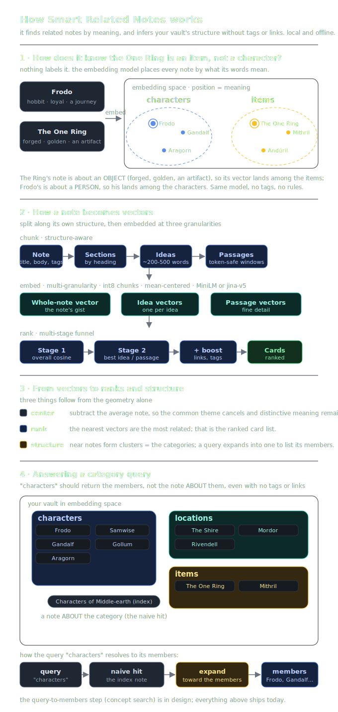

# How Smart Related Notes works

A deep dive into the techniques behind the plugin: how a note becomes a set of
vectors, how related notes are ranked, and where it is heading next. Everything runs
**locally and offline** in Obsidian's renderer (transformers.js on onnxruntime-web,
WASM by default); no note ever leaves your vault and the only network traffic is the
one-time model-weights download.

  

## 1. Chunking: structure-aware, idea-first

A note is not embedded as one blob. It is split along its **own structure** so that
matching can happen at the right granularity:

1. **Sections**: `splitIntoSections` walks the raw markdown and cuts at ATX headings
   (`#`..`######`), carrying a heading breadcrumb. It is code-fence and frontmatter
   aware, so a `#` inside a code block is never mistaken for a heading. Inline markdown
   in the heading (`**bold**`, `[[links]]`) is stripped so the breadcrumb is clean.
2. **Passages**: each section is split into paragraphs, then into ~80-word sentence
   windows (`windowSentences`, one-sentence overlap), and finally each window is held
   under a hard character budget (`splitToBudget`, ~480 chars ≈ 120 tokens) so the
   embedding model never silently truncates a chunk. This is what keeps German
   compounds and long sentences in-distribution.
3. **Ideas**: `assignIdeas` groups consecutive passages into coherent **idea units**
   of roughly 200-500 words. Boundaries are placed at heading transitions and at
   **lexical-cohesion valleys** (a drop in shared content words between neighbours),
   bounded by size rails, with an **atomic-note guard** (short notes stay a single
   idea) and a merge-small pass (no orphan one-sentence "ideas"). A paragraph is a poor
   unit for an idea; this recovers the idea as the user actually thinks of it.

## 2. Embeddings: multi-granularity, two model strategies

Every note is represented at more than one level so a relationship can be found whether
it lives in the whole note or in a single idea.

- **Windowed strategy (default, MiniLM/mpnet/e5):** the note is a title chunk plus the
  passage windows above. The note's overall vector is the L2-normalized mean of its
  passage vectors.
- **Whole-note strategy (jina-v5, opt-in):** because jina has an 8192-token context,
  the note's overall vector is a **single embed of the whole note** (its strongest
  signal), and each **idea is embedded whole** as a chunk. The idea extractor is reused
  to find the boundaries; jina just embeds the full idea rather than 480-char windows.

Storage is dimension-agnostic and tuned for large vaults:

- Chunk vectors are **int8-quantized** (with per-row scales) and expanded back to fp32
  **lazily** through an LRU cache, only when a note enters a Stage-2 shortlist. The
  overall vector is kept as fp32.
- **Mean-centering**: embedding spaces are anisotropic, so unrelated notes still score a
  high baseline cosine. The plugin subtracts the corpus centroid from every vector at
  rank time, so unrelated notes sit near 0 and a `~0.2` cutoff cleanly separates the
  genuinely related ones.
- Frontmatter **tags and aliases are folded into the embed input** (not just the body),
  so a note's category and alternate names influence its vector.

### Why the model choice is what it is

The default is a **paraphrase (symmetric)** model on purpose. Note-to-note relatedness
is a symmetric problem, and a measured A/B on a real vault (link-recall against the
user's own `[[wikilinks]]` as ground truth) found:

| model / strategy | recall@10 |
| --- | --- |
| jina-v5-nano, whole-note | **0.52** |
| MiniLM-L12, windows (default) | 0.43 |
| BGE-M3, windows | 0.35 |
| BGE-M3, whole-note | 0.21 |

Two takeaways: (1) **retrieval models** (BGE-M3, e5) tuned for short-query→document
rank symmetric note similarity *worse*, not better; (2) embedding a whole note as one
long vector only wins with a model actually built for long context (**jina-v5** does;
BGE-M3 does not). jina is opt-in because it is a larger (~250 MB) non-commercial
(CC-BY-NC) download; the default stays small, fast, and permissively licensed.

## 3. Ranking: a multi-stage funnel

For the active note, every other note is scored by a funnel that spends cheap compute
widely and expensive compute narrowly:

1. **Stage 1: shortlist.** Cosine of the centered overall vectors. Cheap (one dot per
   note), so it runs over the whole vault and keeps the top candidates.
2. **Stage 2: fine match.** Over the shortlist only, **bidirectional MaxSim** (`biMax`):
   the symmetric max cosine across the two notes' chunk vectors, with the title chunk
   weighted higher. This is what lets a note related by *one* idea or passage surface
   even when its overall topic differs.
3. **Idea blend.** An optional idea-level signal (`ideaInfluence`) mixes "do these notes
   share a whole idea" into the score, a live knob with no re-index.
4. **Structural boost.** Direct links (either direction), shared tags, and recency nudge
   the score; a `minSimilarity` floor drops the long tail.

## 4. Beyond pure similarity

- **Isolated areas**: activate a tag namespace (e.g. `goa`) and that area becomes a
  self-contained partition: its notes only relate to each other and never appear in any
  other note's cards. A self-contained world or novel stays self-contained.
- **Vault insights** (command): a report built from the index: the strongest
  **related-but-unlinked** pairs (grow a sparse graph), **orphan** notes (no links in or
  out, each with its closest relative), near-**duplicates**, and **suggested tags**
  inferred by **label propagation** (a note missing a tag most of its semantic
  neighbours carry).
- **Linked-notes mode**: a panel toggle that shows what the active note links to (a
  map-of-content's members), the structural complement to similarity.
- **Search**: the sidebar search ranks by best-passage match plus a title/tag boost,
  not just the note average, and inherits whichever model is active.

## 5. Roadmap: tag-free concept search

The hardest open problem: a query like "characters" or "locations" should return the
**member** notes, and it must work even when the user has no tags, no map-of-content
notes, and no useful link graph, by inferring the latent category from the vault's own
patterns (the bottom half of the diagram above).

Plain cosine is symmetric and ranks hypernyms poorly, so a note *about* characters
always beats an individual character on "cosine to characters". The fix is
**seed-prototype ranking**: instead of scoring against the bare query word, build a
**prototype** (the centered mean of an inferred set of seed members) and rank by
closeness to *that*, moving the comparison into the members' own region of the space.

The pipeline layers onto the existing search and can only *add* recall (it unions with
the normal result, never demoting a strong direct hit):

1. **Detect** a category query: the top hit is a cohesion-weighted hub (out-degree ×
   neighbour similarity), or the query routes to a discovered cluster, or it matches a
   nested tag.
2. **Seed**: without tags, from the hub's resolved out-neighbours (a map-of-content's
   links *are* its members) or a discovered content cluster; with tags, also from the
   matching nested tag. Coherence-gated and capped to avoid drift.
3. **Prototype-rank**: re-score notes by closeness to the seed prototype (plus a
   best-passage and a structural member-boost), and *demote* the category-title note so
   the members win.

When there are no tags and no links, seeds come from **spherical k-means clusters**
discovered over the centered note means (computed on idle, kept fresh incrementally),
so the feature still works on pure prose. Tags, links and hubs only **sharpen** it;
they are never required. This is **in design**, not yet shipped.
