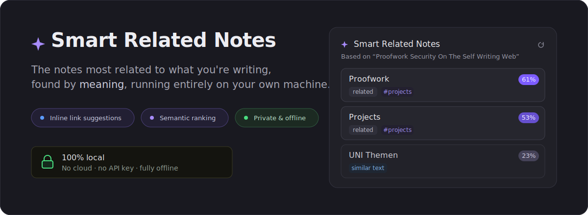
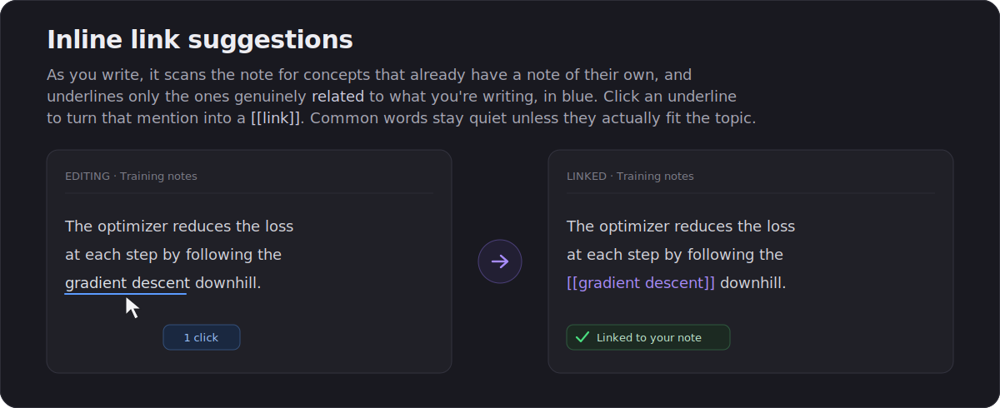
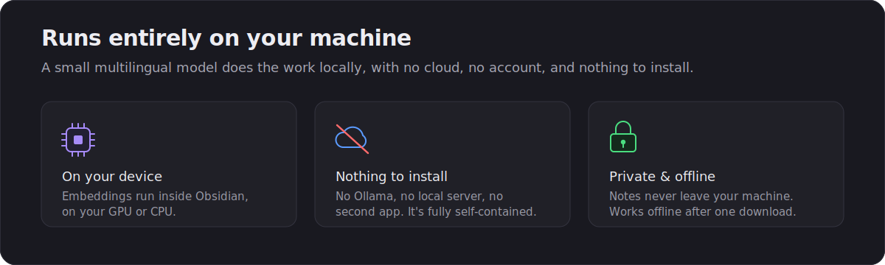
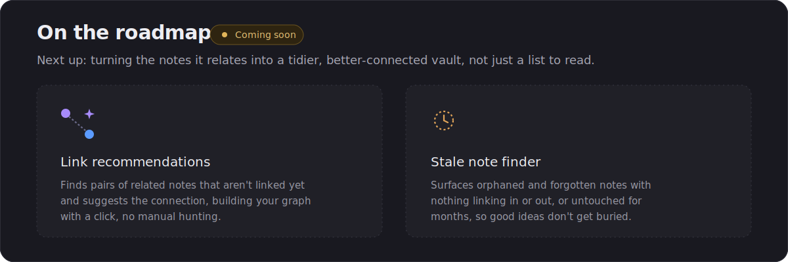

<p align="center">
  
</p>

# Smart Related Notes

A left-sidebar panel that surfaces the notes most **semantically similar** to the
one you're reading, so you browse your vault by meaning, not by folders. Open any
note and the panel ranks the rest by how closely they relate, as a stack of cards
you can click to jump to.

It's powered by a small **multilingual embedding model that runs entirely on your
machine**: no cloud, no API key, no second app or server. Everything happens
locally inside the renderer, so your notes never leave your computer. After a
**one-time** model download (cached on first use), it works **fully offline**. The
model understands German, English, and 100+ other languages, so matches cross
languages naturally.

<p align="center">
  
</p>

<p align="center">
  
</p>

## How it works

Each Markdown note is split into short passages (windows that fit the model's context),
covering the whole note, and every passage is turned into a vector by the embedding
model. Adjacent passages are then grouped into coherent **ideas** (~200-500 words, at
heading and topic boundaries, with short atomic notes kept whole), so a note is
represented at three levels: an **overall vector**, its **idea vectors**, and its
**passage vectors**. For the note you're viewing, every other note is ranked by the
best **cosine similarity** of their passages (with its title weighted), blended with
how strongly the two notes share a whole **idea** — so a note related by one coherent
idea spanning several paragraphs surfaces, not just one lucky passage match. The
closest matches are shown as cards with a similarity percentage.

The model runs through [`@huggingface/transformers`](https://www.npmjs.com/package/@huggingface/transformers)
on the local ONNX runtime, on the **CPU via WASM** by default, multi-threaded so a
full reindex is quick, and memory-stable. (A **WebGPU** option exists and is faster,
but its GPU backend can accumulate memory on large vaults, so it's an explicit opt-in.)
An **Indexing speed** setting trades CPU threads against memory. The runtime's `.wasm`
is **shipped inside the plugin**, so the only network traffic ever is the one-time
download of the model weights from the Hugging Face Hub; afterwards the weights are
cached and nothing is fetched again.

Vectors persist as compact JSON in the plugin's config dir, so the index survives
restarts and only changed notes are re-embedded.

For the full picture — the multi-granularity embeddings, the multi-stage ranking
funnel, the measured model A/B, mean-centering, and the roadmap toward tag-free concept
search — see [ARCHITECTURE.md](ARCHITECTURE.md).

## Features

- **Semantic ranking**: for the active note, ranks every other note by cosine
  similarity and shows the top matches as cards: **title**, muted **folder path**,
  a short **snippet**, and a **similarity %** pill. Click a card to open that note.
  With no note open, the panel lists your **recent notes** instead of sitting empty.
- **Semantic search**: the magnifier in the panel header opens a search box that ranks
  your whole vault by meaning against a typed query (e.g. "goa characters" or
  "proofwork"), not just keyword matches.
- **Linked-notes mode**: the link icon in the panel header switches the cards to show
  what the current note *links to* (its members, if it's a map-of-content) instead of
  what it's similar to. The structural complement to similarity ranking.
- **Inline link suggestions**: when you mention a concept that already has a note, it
  glows with a slim underline; one click turns the mention into a `[[wikilink]]`. It's
  context-aware, so a common word (e.g. "analysis") only glows where it fits the topic,
  and works with or without the easy-links plugin.
- **Fully local & private**: embeddings run in-app on the CPU (WASM, multi-threaded;
  WebGPU optional); notes are never sent anywhere. Works offline after the one-time download.
- **Multilingual**: a multilingual model matches notes across German, English, and
  100+ other languages.
- **Persisted index**: vectors are saved to disk, so reopening the vault is instant
  and doesn't re-embed everything.
- **Incremental updates**: changed, created, and renamed notes are re-embedded on a
  20-second idle pause, so typing never kicks off work mid-edit.
- **Keyword fallback**: while the index is still building (or for a brand-new note
  with no vector yet), the panel falls back to a cheap keyword / tag / link-overlap
  ranking (shown with a `~` pill), so it's never empty.
- **Clear status**: a live status line shows indexing progress; if the model can't
  load (e.g. no connection on first run), it surfaces an error instead of silently
  showing nothing.

## Roadmap

<p align="center">
  
</p>

Next up, going beyond *reading* related notes to *tidying the graph* itself:

- **Link recommendations**: find pairs of related notes that aren't linked yet and
  suggest the connection, so you can build your graph with a click.
- **Stale note finder**: surface orphaned and forgotten notes (nothing linking in or
  out, or untouched for months) so good ideas don't get buried.

## Settings

- **Performance profile**: one-click presets. **Balanced** is lighter and faster;
  **Best quality** uses a larger model and more context for the strongest matches.
- **Model**: the embedding model (a dropdown of vetted choices, or paste a custom
  Hugging Face id). The default `paraphrase-multilingual-MiniLM-L12-v2` is a
  symmetric sentence-similarity model, the right tool for ranking how alike two
  notes are. `paraphrase-multilingual-mpnet-base-v2` (Best quality) is stronger but
  larger. e5 models are retrieval-oriented and rank note similarity less well.
- **Compute device**: **Auto** (recommended) runs on the **CPU (WASM)**, which is
  memory-stable. **WebGPU** is faster but its GPU backend can accumulate memory on
  large vaults, so it's an explicit opt-in. Switching re-downloads the model.
- **Indexing speed**: CPU threads vs memory. **Fast** (all cores, quickest, but the
  worker threads hold several GB), **Balanced** (default), **Light** (1 thread, smallest
  footprint, slower full reindex). Editing a note stays fast at any setting.
- **Number of results**: how many cards to show.
- **Minimum similarity**: hide matches below this topical-similarity score (0–1).
  Scores are mean-centered (the embedding noise floor is removed), so unrelated notes
  sit near 0 and ~0.2 cleanly separates on-topic notes. Raise for a tighter list.
- **Idea influence**: how much idea-level matching blends into the score (0-0.6).
  Notes are grouped into coherent ideas (~200-500 words); this weights whether two
  notes share a whole idea, not just one passage. 0 is passage-only. It is a live
  ranking knob — changing it re-ranks instantly with no re-index, so you can compare.
- **Isolated areas**: self-contained areas, one tag namespace per line (e.g. `goa`).
  A note tagged with an activated namespace (matching `goa` and `goa/character`) only
  relates to, and takes tag suggestions from, other notes in that area, and never
  appears in any other note's cards. Notes in no activated area share one pool. A live
  ranking knob (no re-index). Use it to keep a self-contained project (a novel, a world)
  from bleeding into unrelated notes.
- **Max chunks per note** (advanced): ceiling on passages embedded per note. The
  whole note is covered up to this cap; only very long notes approach it.
- **Heading context** (advanced): embeds each section's first chunk with its note +
  heading breadcrumb for context. On by default; toggle to compare.
- **Excluded folders**: folders left out of the index entirely (and everything
  beneath them); not ranked and not suggested as links. One per line or comma-separated.
- **Folders excluded from link suggestions**: folders whose notes stay indexed and
  ranked in the panel, but are never suggested as inline `[[links]]`.
- **Show snippet**: toggle the per-card text preview.
- **Rebuild index**: force a full re-embed (also on the command palette and the
  panel's refresh icon).

Changing the model or compute device transparently rebuilds the index; unrelated
changes (sliders, toggles) never trigger a re-embed.

### Vault insights (command)

Run **"Vault insights (suggested links, orphans, duplicates)"** from the command
palette to generate a report note for the whole vault:

- **Suggested links**: the strongest related notes that you have *not* linked yet,
  ranked by similarity. The fastest way to grow a sparse graph.
- **Suggested tags**: notes that are missing a tag most of their semantic neighbours
  share. The plugin infers a likely category (e.g. a character profile that lacks your
  `goa/character` tag) from similarity alone, only proposing discriminative tags.
- **Orphan notes**: notes with no links in or out, each paired with its closest
  relative as a starting point.
- **Possibly duplicate**: near-identical pairs worth merging or cross-linking.
- **Stale notes**: the oldest-edited notes, for review.

It writes/refreshes `Vault Insights (Smart Related Notes).md` and opens it; every entry
is a clickable wikilink. Nothing is changed in your notes.

## Install

### From a release

Download `smart-related-notes.zip` from the latest release and extract it into
`.obsidian/plugins/smart-related-notes/`. The zip already includes the ONNX runtime
`.wasm` in its `ort/` folder, so nothing extra is needed. Only the model weights
are fetched, once, on first use.

### With BRAT

Add this repository in [BRAT](https://github.com/TfTHacker/obsidian42-brat) and
enable **Smart Related Notes** from the community-plugins list.

On first launch the model weights download from the Hugging Face Hub with a progress
notice, then cache. This happens once; after that the plugin works offline. The
WebGPU (GPU) path uses fp32 weights (~470 MB for the default model); the WASM (CPU)
path uses smaller quantized weights (~110 MB). The model is downloaded once per
backend, then cached.

## Requirements

- Desktop only (the embedding runtime needs a desktop Electron environment).
- Obsidian 1.7.2 or newer.

## Development

A TypeScript project bundled with esbuild (entry `src/main.ts` → root `main.js`).

```bash
npm install          # install dev dependencies
npm run dev          # esbuild watch build (inline sourcemap, no minify)
npm run build        # gen-ort -> tsc --noEmit -> minified production bundle
npm run lint         # eslint (typescript-eslint + eslint-plugin-obsidianmd)
```

`gen-ort.mjs` runs before tsc/lint/esbuild: it writes `src/ort-version.ts` (the
pinned `onnxruntime-web` version + a CDN fallback URL) and copies the matching
`onnxruntime-web` `.wasm`/`.mjs` assets into `ort/`. Both are build artifacts and are
gitignored. The release workflow packages `main.js`, `manifest.json`, `styles.css`,
and the `ort/` folder into `smart-related-notes.zip`.

The renderer reports itself as a Node environment, which would otherwise make
transformers.js pick the (externalized, unavailable) `onnxruntime-node` backend.
`src/ort-shim.ts` (imported first in `main.ts`) installs the bundled
`onnxruntime-web` under `Symbol.for("onnxruntime")` before transformers loads, so the
web runtime is used and WebGPU/WASM work.

## License

MIT © 2026 Saiki77
