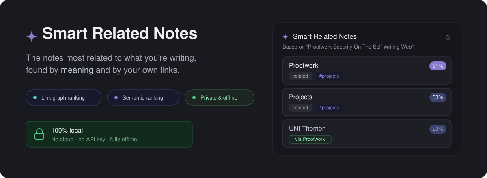
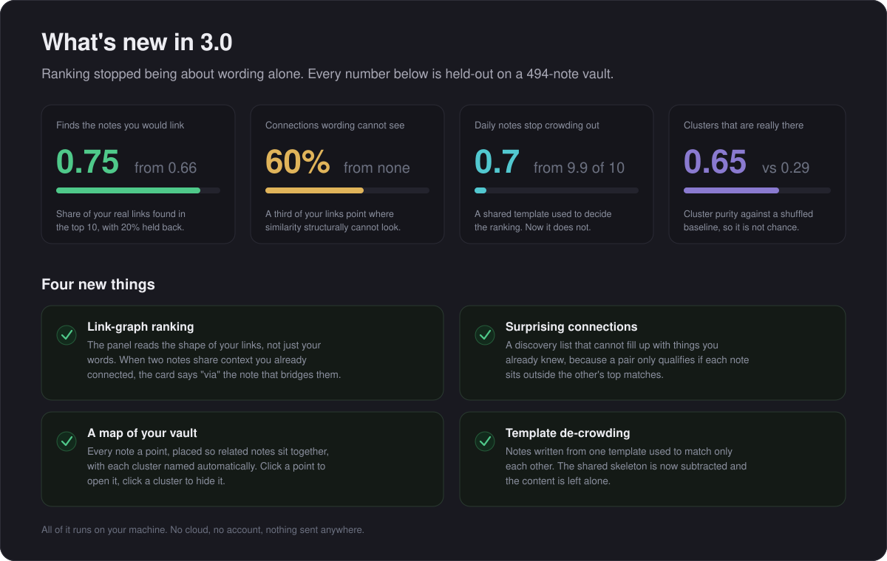
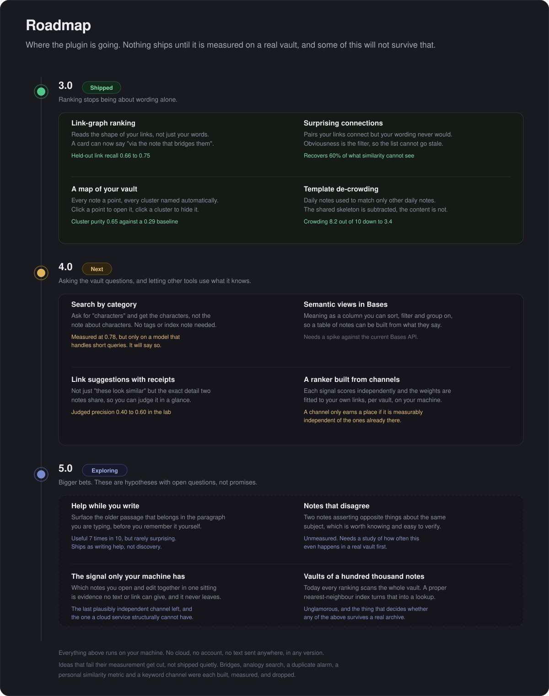
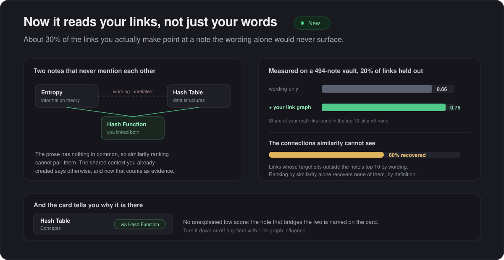
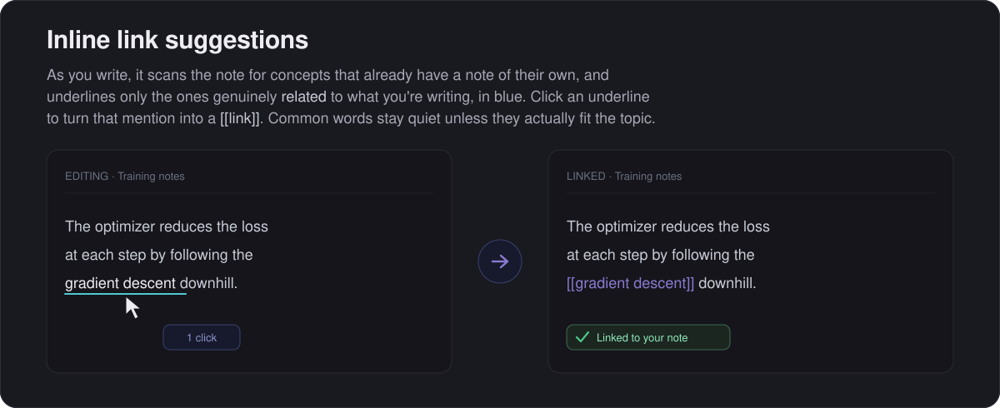
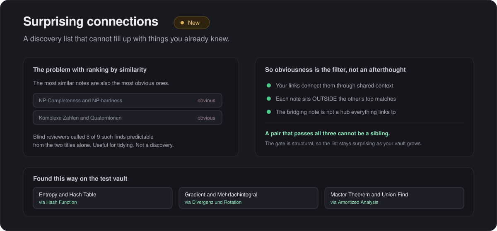
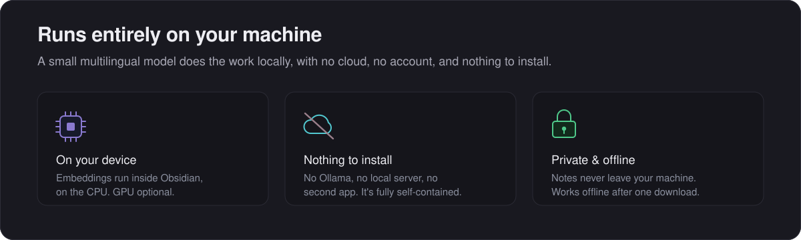
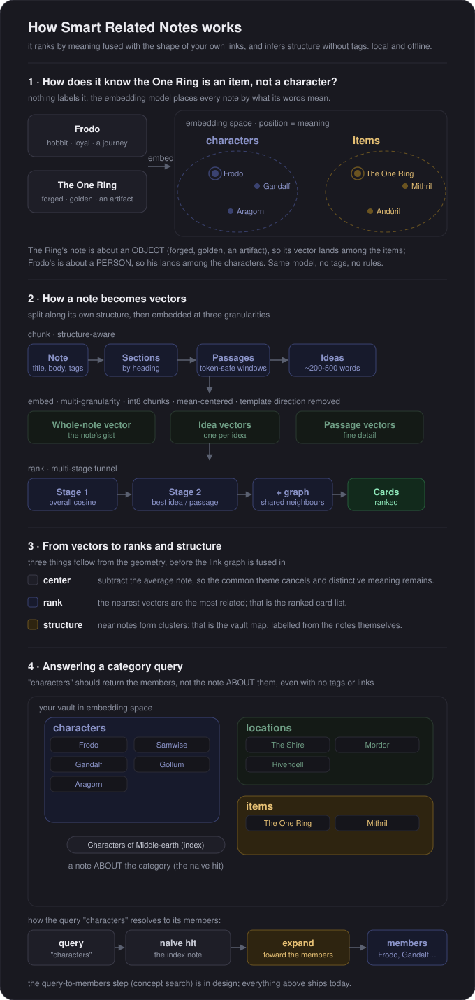

<p align="center">
  
</p>

# Smart Related Notes

A left-sidebar panel that surfaces the notes most **semantically similar** to the
one you're reading, so you browse your vault by meaning, not by folders. Open any
note and the panel ranks the rest by how closely they relate, as a stack of cards
you can click to jump to.

It runs on a small **multilingual embedding model that lives entirely on your
machine**: no cloud, no API key, no second app or server. After a **one-time**
model download it works **fully offline**, and it understands German, English and
100+ other languages, so matches cross languages naturally.

**Contents** &nbsp;·&nbsp; [What's new](#whats-new-in-30) &nbsp;·&nbsp;
[Roadmap](#roadmap) &nbsp;·&nbsp; [Install](#install) &nbsp;·&nbsp;
[What it does](#what-it-does) &nbsp;·&nbsp; [How it works](#how-it-works)
&nbsp;·&nbsp; [Settings](#settings)

## What's new in 3.0

<p align="center">
  
</p>

Ranking stopped being about wording alone. The panel now also reads the shape of
your own links, which is what produced every number above. Full detail lives in
[ARCHITECTURE.md](ARCHITECTURE.md); the short version is that similarity and your
link graph disagree often enough to be worth fusing, and roughly a third of the
links you make point somewhere similarity structurally cannot look.

## Roadmap

<p align="center">
  
</p>

**Next, in 4.0.** Asking the vault questions, and letting other tools use what it
knows:

- **Search by category**: ask for "characters" and get the characters, not the note
  *about* characters, with no tags and no map-of-content required. Measured at 0.78
  member-precision, but only on a model that can handle short queries; on a plain
  paraphrase model the same pipeline tops out at 0.42, so the feature will only offer
  itself where it works rather than quietly returning noise.
- **Semantic views in Bases**: meaning as a column you can sort, filter and group on.
- **Link suggestions with receipts**: not "these look similar" but the exact detail
  two notes share, so you can judge it at a glance. The underlying gate stack was
  measured on a related study (judged precision 0.40 to 0.60 at n=15, 95% interval
  0.36 to 0.80); the feature itself has not been measured yet.
- **A ranker built from channels**: each signal scores independently, with the weights
  fitted to your own links, per vault, on your machine. The admission rule is the
  interesting part: a new channel only earns a place if it is measurably *independent*
  of the ones already there. That is how the link-graph channel was chosen. Its rank
  correlation with the content channel is 0.075 and it added 0.08 recall; a keyword
  channel correlated at 0.30 and made things worse.

**Exploring, for 5.0.** Hypotheses with open questions rather than promises:

- **The signal only your machine has**: which notes you open and edit in one sitting is
  evidence neither the text nor the links can give, and it is the last plausibly
  independent channel left. It is also the one a cloud service structurally cannot
  have, because that data never leaves your computer.
- **Vaults of a hundred thousand notes**: every ranking currently scans the whole
  vault. A real nearest-neighbour index turns that into a lookup. Unglamorous, and the
  thing that decides whether any of the above survives a serious archive.
- **Notes that disagree**, and **help while you write**.

Ideas that fail their measurement get cut rather than shipped quietly. Bridges,
analogy search, a duplicate alarm, a personal similarity metric and a keyword channel
were each built, measured, and dropped.

## Install

### From a release

Download `main.js`, `manifest.json`, and `styles.css` from the latest release into
`.obsidian/plugins/smart-related-notes/`. On first use the plugin fetches, once,
the version-pinned ONNX runtime (cached into its `ort/` folder) and the model
weights; after that it works offline.

### With BRAT

Add this repository in [BRAT](https://github.com/TfTHacker/obsidian42-brat) and
enable **Smart Related Notes** from the community-plugins list.

On first launch the model weights download from the Hugging Face Hub with a progress
notice, then cache. This happens once; after that the plugin works offline. The
WebGPU (GPU) path uses fp32 weights (~470 MB for the default model); the WASM (CPU)
path uses smaller quantized weights (~110 MB). The model is downloaded once per
backend, then cached.

## What it does

### Finding what relates

- **Semantic ranking**: for the active note, ranks every other note by meaning and
  shows the top matches as cards: **title**, muted **folder path**, a short
  **snippet**, and a **similarity %** pill. Click a card to open that note. With no
  note open, the panel lists your **recent notes** instead of sitting empty.
- **Link-graph ranking**: the panel does not rank by wording alone. When two notes
  share context you have already connected them through, that counts as evidence they
  belong together, and such a card says *via* the note that bridges them. This is what
  lifted held-out link recall from 0.66 to 0.75.
- **Semantic search**: the magnifier in the panel header ranks your whole vault by
  meaning against a typed query, not just keyword matches.
- **Linked-notes mode**: the link icon switches the cards to show what the current
  note *links to*, the structural complement to similarity ranking.

<p align="center">
  
</p>

### Building your graph

- **Inline link suggestions**: when you mention a concept that already has a note, it
  glows with a slim underline; one click turns the mention into a wikilink. It is
  context-aware, so a common word like "analysis" only glows where it fits the topic,
  and it works with or without the easy-links plugin.
- **Smarter `[[` completion**: typing `[[` ranks existing notes by how well they fit
  what you are writing, and offers to create a new note for a strongly relevant
  concept that does not have one yet.
- **Vault insights**: a whole-vault report of suggested links, orphans, near
  duplicates, stale notes and suggested tags. See [below](#vault-insights).

<p align="center">
  
</p>

### Seeing your vault

- **Vault map**: every note as a point, placed so notes about similar things sit
  together, coloured by cluster and labelled automatically from the notes themselves.
  Click a point to open it, click a cluster to hide it. Open it with the **Open the
  vault map** command.
- **Surprising connections**: pairs your links connect through shared context but
  whose wording is too different for similarity to ever pair them. Because each note
  must sit outside the other's top matches to qualify, this list cannot fill up with
  obvious siblings the way a similarity ranking does.

<p align="center">
  
</p>

### Private, and it stays that way

- **Fully local**: embeddings run in-app on the CPU (WASM, multi-threaded; WebGPU
  optional). Notes are never sent anywhere, and it works offline after the one-time
  download.
- **Multilingual**: matches notes across German, English and 100+ other languages.
- **Persisted index**: vectors are saved to disk, so reopening the vault is instant.
- **Incremental updates**: changed, created and renamed notes are re-embedded on a
  20-second idle pause, so typing never kicks off work mid-edit.
- **Keyword fallback**: while the index is still building, the panel falls back to a
  cheap keyword ranking (shown with a `~` pill) so it is never empty.
- **Clear status**: a live status line shows progress, and surfaces an error rather
  than silently showing nothing.

<p align="center">
  
</p>

### Vault insights

Run **"Vault insights (suggested links, orphans, duplicates)"** from the command
palette to generate a report note for the whole vault:

- **Suggested links**: the strongest related notes that you have *not* linked yet,
  ranked by similarity. The fastest way to grow a sparse graph.
- **Surprising connections**: pairs your links connect through shared context but
  whose wording is too different for similarity to ever pair them. Each note sits
  outside the other's top matches, so this list cannot fill up with obvious
  siblings the way a similarity ranking does. Every entry names the note that
  bridges the two.
- **Suggested tags**: notes that are missing a tag most of their semantic neighbours
  share. The plugin infers a likely category (e.g. a character profile that lacks your
  `goa/character` tag) from similarity alone, only proposing discriminative tags.
- **Orphan notes**: notes with no links in or out, each paired with its closest
  relative as a starting point.
- **Possibly duplicate**: near-identical pairs worth merging or cross-linking.
- **Stale notes**: the oldest-edited notes, for review.

It writes/refreshes `Vault Insights (Smart Related Notes).md` and opens it; every entry
is a clickable wikilink. Nothing is changed in your notes.

## How it works

<p align="center">
  
</p>

Each Markdown note is split into short passages (windows that fit the model's context),
covering the whole note, and every passage is turned into a vector by the embedding
model. Adjacent passages are then grouped into coherent **ideas** (~200-500 words, at
heading and topic boundaries, with short atomic notes kept whole), so a note is
represented at three levels: an **overall vector**, its **idea vectors**, and its
**passage vectors**. For the note you're viewing, every other note is ranked by the
best **cosine similarity** of their passages (with its title weighted), blended with
how strongly the two notes share a whole **idea**, so a note related by one coherent
idea spanning several paragraphs surfaces, not just one lucky passage match. The
closest matches are shown as cards with a similarity percentage.

The model runs through [`@huggingface/transformers`](https://www.npmjs.com/package/@huggingface/transformers)
on the local ONNX runtime, on the **CPU via WASM** by default, multi-threaded so a
full reindex is quick, and memory-stable. (A **WebGPU** option exists and is faster,
but its GPU backend can accumulate memory on large vaults, so it's an explicit opt-in.)
The whole engine lives in its **own worker**, which is **shut down after an idle
period** (configurable) — so when you're just reading and browsing, the model's
hundreds of MB to several GB are returned to the system instead of sitting resident;
it reloads transparently in a few seconds when next needed. An **Indexing speed**
setting trades CPU threads against reindex time. The only network traffic ever is
one-time: the model weights from the Hugging Face Hub, and the ONNX runtime
`.wasm` (version-pinned), which is cached into the plugin's own folder; afterwards
nothing is fetched again and the plugin works offline.

Vectors persist as compact JSON in the plugin's config dir, so the index survives
restarts and only changed notes are re-embedded.

For the full picture, see [ARCHITECTURE.md](ARCHITECTURE.md): the multi-granularity
embeddings, the multi-stage ranking funnel, the measured model A/B, mean-centering, the
structural channel that ranks by your link graph, template de-crowding, and where
tag-free concept search stands.

## Settings

### Quality and speed

- **Performance profile**: one-click presets. **Balanced** is lighter and faster;
  **Best quality** uses a larger model and more context for the strongest matches.
- **Model**: the embedding model (a dropdown of vetted choices, or paste a custom
  Hugging Face id). The default `paraphrase-multilingual-MiniLM-L12-v2` is a
  symmetric sentence-similarity model, the right tool for ranking how alike two
  notes are. `paraphrase-multilingual-mpnet-base-v2` (Best quality) is stronger but
  larger. e5 models are retrieval-oriented and rank note similarity less well.
- **Compute device**: **Auto** (recommended) runs on the **CPU (WASM)**, which is
  memory-stable. **WebGPU** is faster but its GPU backend can accumulate memory on
  large vaults, so it's an explicit opt-in. Switching re-downloads the model.
- **Indexing speed**: how many CPU threads embed notes. **Fast** (all cores,
  quickest), **Balanced** (default), **Light** (1 thread, slowest). A CPU/speed
  knob — the engine's memory is dominated by the loaded model itself, not the
  thread count. Editing a note stays fast at any setting.
- **Unload model when idle**: after this long without indexing or searching
  (default 15 minutes; "Right after use" unloads 30 seconds after the last
  embed), the embedding engine is shut down and its memory returned to the
  system. It reloads automatically in a few seconds on the next use — no
  re-download. Ranking when switching notes never needs the engine and is
  unaffected.

### The panel

- **Number of results**: how many cards to show.
- **Minimum similarity**: hide matches below this topical-similarity score (0-1).
  Scores are mean-centered (the embedding noise floor is removed), so unrelated notes
  sit near 0 and ~0.2 cleanly separates on-topic notes. Raise for a tighter list.
- **Show snippet**: toggle the per-card text preview.

### Ranking

- **Link-graph influence**: how much the shape of your links counts alongside the
  wording (0-1, default 1). This is the 3.0 channel described above; 0 reverts to
  ranking by content only. A live knob, no re-index.
- **Idea influence**: how much idea-level matching blends into the score (0-0.6).
  Notes are grouped into coherent ideas (~200-500 words); this weights whether two
  notes share a whole idea, not just one passage. 0 is passage-only. It is a live
  ranking knob; changing it re-ranks instantly with no re-index, so you can compare.
- **Isolated areas**: self-contained areas, one tag namespace per line (e.g. `goa`).
  A note tagged with an activated namespace (matching `goa` and `goa/character`) only
  relates to, and takes tag suggestions from, other notes in that area, and never
  appears in any other note's cards. Notes in no activated area share one pool. A live
  ranking knob (no re-index). Use it to keep a self-contained project (a novel, a world)
  from bleeding into unrelated notes.

### Scope

- **Excluded folders**: folders left out of the index entirely (and everything
  beneath them); not ranked and not suggested as links. One per line or comma-separated.
- **Folders excluded from link suggestions**: folders whose notes stay indexed and
  ranked in the panel, but are never suggested as inline wikilinks.

### Advanced

- **Max chunks per note**: ceiling on passages embedded per note. The whole note is
  covered up to this cap; only very long notes approach it.
- **Heading context**: embeds each section's first chunk with its note + heading
  breadcrumb for context. On by default; toggle to compare.
- **Rebuild index**: force a full re-embed (also on the command palette and the
  panel's refresh icon).

Changing the model or compute device transparently rebuilds the index; unrelated
changes (sliders, toggles) never trigger a re-embed.

## Requirements

- Desktop only (the embedding runtime needs a desktop Electron environment).
- Obsidian 1.7.2 or newer.

## Development

A TypeScript project bundled with esbuild (entry `src/main.ts` → root `main.js`).

```bash
npm install          # install dev dependencies
npm run dev          # esbuild watch build (inline sourcemap, no minify)
npm run build        # gen-ort -> tsc --noEmit -> minified production bundle
npm run lint         # eslint (typescript-eslint + eslint-plugin-obsidianmd)
```

`gen-ort.mjs` runs before tsc/lint/esbuild: it writes `src/ort-version.ts` (the
pinned `onnxruntime-web` version + the CDN base the runtime is downloaded from)
and copies the matching `onnxruntime-web` `.wasm`/`.mjs` assets into `ort/` for
local dev builds. Both are build artifacts and are gitignored. Releases ship only
`main.js`, `manifest.json`, and `styles.css` (exactly what Obsidian downloads);
at runtime the plugin caches the pinned ONNX runtime into its `ort/` folder on
first use, validated against byte sizes pinned at build time so torn writes or a
plugin update carrying a different runtime build trigger a clean re-download
instead of mixing builds.

The embedding engine (transformers.js + onnxruntime-web) runs inside a dedicated
Web Worker bundled as a second esbuild stage and inlined into `main.js` (see
`esbuild.config.mjs` and `src/worker/embed-worker.ts`); terminating that worker is
what returns the engine's memory to the OS when idle. Environments that expose a
Node-like `process` would make transformers.js pick the (externalized,
unavailable) `onnxruntime-node` backend — `src/ort-shim.ts` (imported first in
the worker entry) flips the relevant process markers during module evaluation so
the web runtime is used and WebGPU/WASM work.

## License

MIT © 2026 Saiki77
